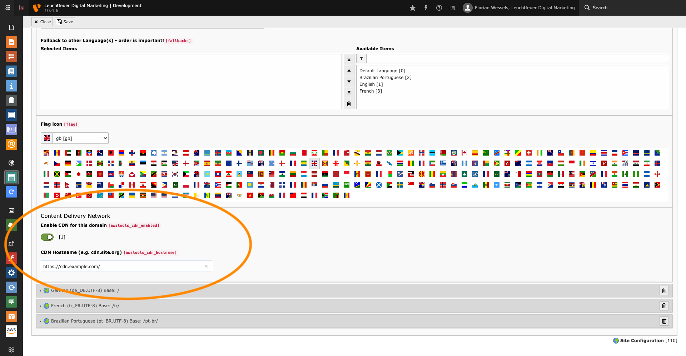
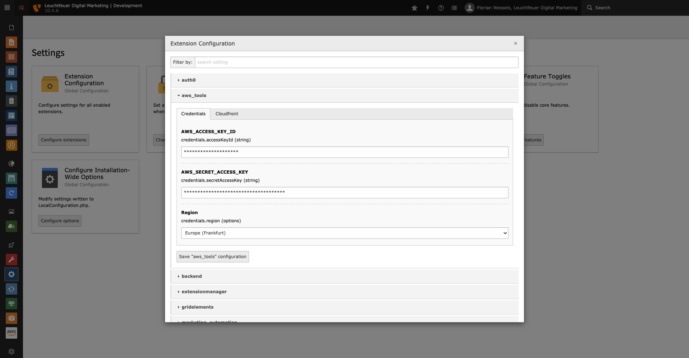
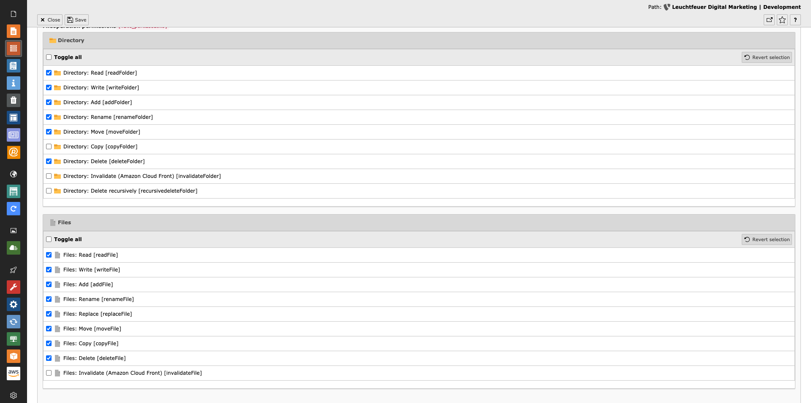

.. include:: ../../Includes.txt

.. _admin-configuration:

=============
Configuration
=============

To activate the Content Delivery Network and to be able to invalidate Amazon CloudFront entries, several settings are necessary,
which have to be carried out in different places (TypoScript, Site Configuration, Extension Configuration, ...).

.. _admin-configuration-siteConfiguration:

Site Configuration
==================

The Content Delivery Network  (CDN) can be enabled and configured (regardless if Amazon CloudFront is used) in the language
configuration of the page configuration. The CDN can be enabled or disabled per domain and per language.

   CDN Settings within the Site Configuration

.. _admin-configuration-rewriteFilePaths:

Rewrite File Paths
==================

All paths to assets located in resource stores (fileadmin, etc.) are automatically rewritten by a TYPO3 interface. Since not all
files are "fetched" by this mechanism, file paths (e.g. paths to stylesheets or JavaScript and fonts located in a separate site 
extension) configured in the TypoScript setup are rewritten by a regular expression.

.. code-block:: typoscript

   config.tx_awstools {
       enabled = 1

       patterns {
           10 {
               search = "/typo3temp/
               replace = "%s/typo3temp/
           }

           20 {
               search = "/typo3conf/
               replace = "%s/typo3conf/
           }
       }

       replacer {
           eventListener = 1
           middleware = 1
       }
   }

The "patterns" option can be extended by any number of additional entries. Each property must have the keys "search" and 
"replace". The `%s` in the replace property will be replaced by the previously configured CDN domain.

.. note::

   Please note the quotation mark in the values of "search" and "replace". The HTML source code of the page is searched for this
   pattern, so that it applies to `href="/typo3temp/assets/...` for example. If the pattern did not include the quotation mark,
   this would lead to serious errors, as links like `href="https://cdn.example.com/typo3temp/assets/"` would be rewritten to
   `https://cdn.example.comhttps://cdn.example.com/typo3temp/assets/`.

Additionally, the value `config` can be used to deactivate content replacement. This will disable path rewriting in frontend.

There are two replacer mechanisms which can be individually enabled/disabled with the `replacer` options.
`middleware` takes care of rewriting URLs within the HTML body which is generated by TYPO3. It only rewrites domains in the HTML code.
If CDN domains for resources are required before rendering the HTML the option `eventListener` can be used which hooks into the
GeneratePublicUrlForResourceEvent and rewrites domains directly when public URLs of resources are generated.

.. _admin-configuration-extensionConfiguration:

Extension Configuration
=======================

In the extension configuration you enter the access data for your AWS account (Access Key ID and Secret Access Key). In addition, 
you must select the region over which the requests to the AWS servers to invalidate entries should run. On the CloudFront tab, 
you can specify a comma-separated list of distributions where your assets are stored.

   AWS Tools extension configuration

.. note::

   Please note that all entries are always invalidated simultaneously in all configured distributions.

.. _admin-configuration-accessProtection:

Access Protection
=================

Appropriate permissions are required so that users can invalidate the Amazon CloudFront entries. The permissions can be granted in
the backend group or user data record (`invalidateFile` or `invalidateFolder`).

   Configure permissions for users or groups

.. note::

   Administrators can invalidate the entries without further permissions.
