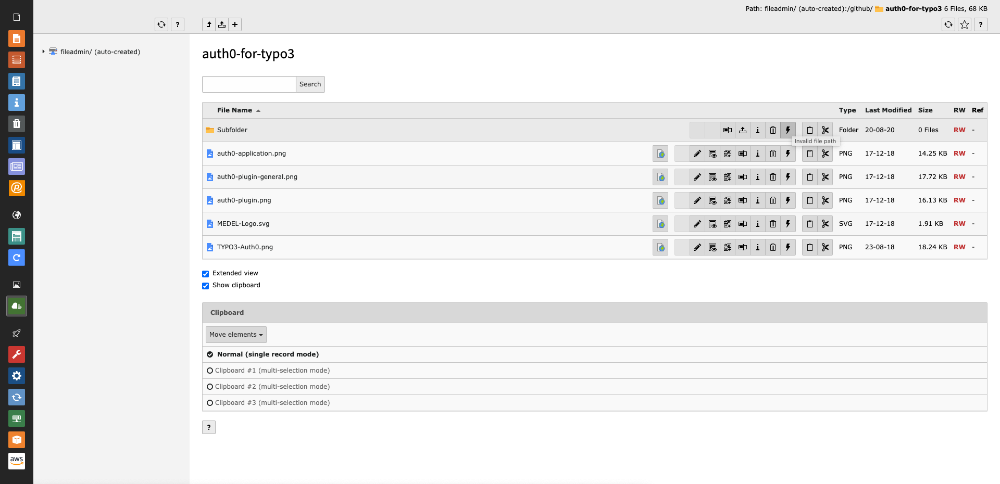
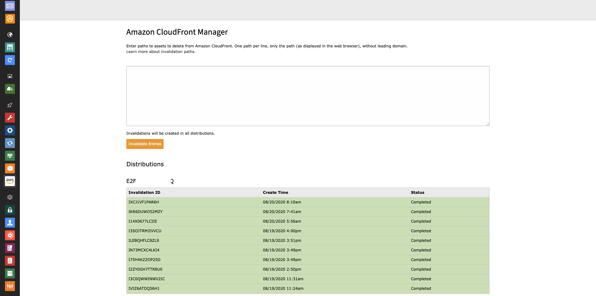
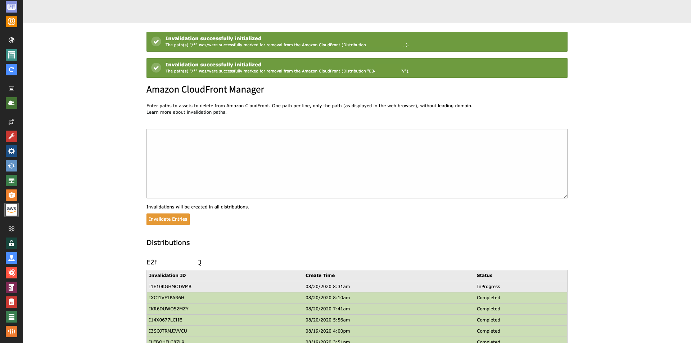

.. include:: ../Includes.txt

.. _editor:

====================================
Invalidate Amazon CloudFront Entries
====================================

Amazon CloudFront entries are partially invalidated automatically or can be manually declared invalid by the user or command line
calls.

.. _editor-symfonyCommand:

Symfony Command (CLI Only)
==========================

Amazon CloudFront entries can be invalidated via a CLI call. The command expects one or more paths (to files or folders).

.. code-block:: bash

   vendor/bin/typo3cms aws:cf:invalidate PATH_1 PATH_2 [...] PATH_X

The command can be executed after a deployment, for example. This command is not available as scheduler task.

.. _editor-fileListModule:

File List Module
================

Amazon CloudFront entries can be invalidated using the File List module. Depending on user permissions (see: below) files or whole
paths can be invalidated.

   Invalidate entries in the File List module

.. _editor-fileListModule-automaticInvalidation:

Automatic Invalidation on Overwriting
-------------------------------------

Amazon CloudFront entries will be invalidated automatically after overwriting an existing file in the file list module -
regardless of the authorizations of the user.

.. _editor-backendModule:

Backend Module
==============

A dedicated backend module (only accessible for administrators) offers another possibility to invalidate Amazon CloudFront
entries. The module also lists the last ten requests (per distribution) to the AWS server.

   Backend view of the AWS Tools module

   Backend view of the AWS Tools module after invalidating entries
